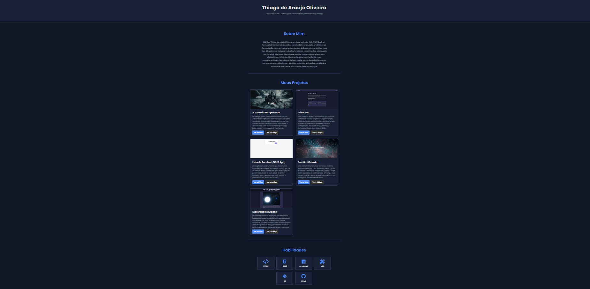

# Portfólio de Desenvolvedor - [Thiago de Araujo Oliveira ]

Bem-vindo ao repositório do meu portfólio pessoal! Este site foi criado para apresentar os projetos que desenvolvi enquanto aprimoro minhas habilidades em desenvolvimento web.

**➡️ Veja o site ao vivo:** [https://t-h-i-a-g-o-a-r-a-u-j-o.github.io/Thiago-Araujo/](https://t-h-i-a-g-o-a-r-a-u-j-o.github.io/Thiago-Araujo/)

---

## 🚀 Sobre o Projeto

Este é um site de portfólio de página única, totalmente responsivo, construído do zero para servir como uma galeria central para meus trabalhos mais importantes. O objetivo foi criar uma interface limpa, profissional e agradável para exibir minhas habilidades e projetos.

 

---

## 🛠️ Tecnologias Utilizadas

As seguintes tecnologias foram usadas na construção deste projeto:

* **HTML5:** Para a estrutura semântica do conteúdo.
* **CSS3:** Para a estilização, layout com Flexbox/Grid e design responsivo.
* **JavaScript (Puro/Vanilla):** Para a interatividade e a lógica por trás dos componentes.

---

## ✨ Funcionalidades

* **Design Responsivo:** O layout se adapta perfeitamente a desktops, tablets e celulares.
* **Galeria de Projetos:** Uma seção principal que exibe 5 projetos de destaque com descrições e links.
* **Seções Claras:** Apresentação clara com seções de "Sobre Mim", "Habilidades" e "Contato".

---

## ✉️ Contato

* **LinkedIn:** [www.linkedin.com/in/thiagoaoliveirahtml]
* **Email:** [thiago_ar@hotmail.com.br]
